# Vegapunk Architecture Diagrams

## 1. System Overview

```mermaid
graph TB
    subgraph "External Interfaces"
        UI["🖥️ React Dashboard<br/>(Material-UI)"]
        REST["🔌 REST API<br/>(Express)"]
        GQL["📊 GraphQL API<br/>(Apollo)"]
        WS["🔄 WebSocket<br/>(Subscriptions)"]
    end

    subgraph "Orchestration Layer"
        SO["🎭 StellarOrchestra<br/>(Central Orchestrator)"]
        TA["📋 TaskAllocator"]
        CE["🤝 CollaborationEngine"]
        SYS["⚙️ SystemOptimizer"]
        AMB["📡 AdvancedMessageBus"]
    end

    subgraph "Specialized Agents"
        SHAKA["⚔️ ShakaAgent<br/>(Ethics & Wisdom)"]
        ATLAS["🛡️ AtlasAgent<br/>(Security & Automation)"]
        EDISON["💡 EdisonAgent<br/>(Innovation & Logic)"]
        PYTHAG["📐 PythagorasAgent<br/>(Data & Research)"]
        LILITH["🎨 LilithAgent<br/>(Creativity & Chaos)"]
        YORK["⚡ YorkAgent<br/>(Efficiency & Resources)"]
    end

    subgraph "Core Infrastructure"
        LLM["🧠 LLM Adapter<br/>(Ollama/OpenAI)"]
        MEM["💾 Memory System<br/>(Multi-tier)"]
        KNOW["📚 Knowledge Base"]
        TASK["📝 Task Manager"]
    end

    subgraph "Analytics & Learning"
        AE["📈 Analytics Engine"]
        FL["🔐 Federated Learning"]
        PA["🔒 Privacy Analytics"]
    end

    %% UI Connections
    UI --> REST
    UI --> GQL
    UI --> WS

    %% API to Orchestration
    REST --> SO
    GQL --> SO
    WS --> SO

    %% Orchestration Components
    SO --> TA
    SO --> CE
    SO --> SYS
    SO <--> AMB

    %% Message Bus to Agents
    AMB <--> SHAKA
    AMB <--> ATLAS
    AMB <--> EDISON
    AMB <--> PYTHAG
    AMB <--> LILITH
    AMB <--> YORK

    %% Agents to Infrastructure
    SHAKA --> LLM
    ATLAS --> LLM
    EDISON --> LLM
    PYTHAG --> LLM
    LILITH --> LLM
    YORK --> LLM

    %% Memory connections
    SHAKA <--> MEM
    ATLAS <--> MEM
    EDISON <--> MEM
    PYTHAG <--> MEM
    LILITH <--> MEM
    YORK <--> MEM

    %% Analytics connections
    SO --> AE
    AE --> FL
    AE --> PA
    
    %% Task Manager
    TA --> TASK
    TASK --> AMB

    classDef ui fill:#2196F3,stroke:#1976D2,stroke-width:2px,color:#fff
    classDef orchestration fill:#9C27B0,stroke:#7B1FA2,stroke-width:2px,color:#fff
    classDef agent fill:#4CAF50,stroke:#388E3C,stroke-width:2px,color:#fff
    classDef infra fill:#FF9800,stroke:#F57C00,stroke-width:2px,color:#fff
    classDef analytics fill:#F44336,stroke:#D32F2F,stroke-width:2px,color:#fff

    class UI,REST,GQL,WS ui
    class SO,TA,CE,SYS,AMB orchestration
    class SHAKA,ATLAS,EDISON,PYTHAG,LILITH,YORK agent
    class LLM,MEM,KNOW,TASK infra
    class AE,FL,PA analytics
```

## 2. Agent Architecture Detail

```mermaid
graph TB
    subgraph "Agent Architecture"
        subgraph "Base Agent (AgenticSatellite)"
            CORE["🎯 Core Engine"]
            THINK["🤔 think()"]
            ACT["🎬 act()"]
            EVAL["📊 evaluate()"]
            LEARN["📚 learn()"]
        end

        subgraph "Specialized Components"
            subgraph "ShakaAgent"
                EM["⚖️ EthicalMatrix"]
                WK["🧘 WisdomKeeper"]
                CF["🤲 ConflictResolver"]
            end

            subgraph "AtlasAgent"
                SM["🔍 SecurityMonitor"]
                IR["🚨 IncidentResponder"]
                AUT["🤖 AutomationEngine"]
            end

            subgraph "EdisonAgent"
                PS["🧩 ProblemSolver"]
                IE["💡 InnovationEngine"]
                LE["🧮 LogicEngine"]
            end

            subgraph "PythagorasAgent"
                DA["📊 DataAnalyzer"]
                RE["🔬 ResearchEngine"]
                CE["🧮 ComputationalEngine"]
            end

            subgraph "LilithAgent"
                CR["🎨 CreativityEngine"]
                EX["🌌 ExplorationEngine"]
                QT["🌀 QuantumThinking"]
            end

            subgraph "YorkAgent"
                RO["📈 ResourceOptimizer"]
                SM2["🔧 SystemMaintainer"]
                PE["⚡ PerformanceEngine"]
            end
        end

        subgraph "Shared Systems"
            MEM_SYS["💾 Memory System"]
            LLM_INT["🧠 LLM Interface"]
            MSG_BUS["📡 Message Bus"]
            KNOW_BASE["📚 Knowledge Base"]
        end
    end

    %% Core connections
    CORE --> THINK
    THINK --> ACT
    ACT --> EVAL
    EVAL --> LEARN
    LEARN --> CORE

    %% Shaka connections
    THINK -.-> EM
    THINK -.-> WK
    ACT -.-> CF

    %% Atlas connections
    THINK -.-> SM
    ACT -.-> IR
    ACT -.-> AUT

    %% Edison connections
    THINK -.-> PS
    THINK -.-> IE
    THINK -.-> LE

    %% Pythagoras connections
    THINK -.-> DA
    THINK -.-> RE
    ACT -.-> CE

    %% Lilith connections
    THINK -.-> CR
    THINK -.-> EX
    THINK -.-> QT

    %% York connections
    THINK -.-> RO
    ACT -.-> SM2
    EVAL -.-> PE

    %% Shared system connections
    CORE <--> MEM_SYS
    CORE <--> LLM_INT
    CORE <--> MSG_BUS
    CORE <--> KNOW_BASE

    classDef core fill:#3F51B5,stroke:#303F9F,stroke-width:2px,color:#fff
    classDef specialized fill:#00BCD4,stroke:#0097A7,stroke-width:2px,color:#fff
    classDef shared fill:#FFC107,stroke:#FFA000,stroke-width:2px,color:#000

    class CORE,THINK,ACT,EVAL,LEARN core
    class EM,WK,CF,SM,IR,AUT,PS,IE,LE,DA,RE,CE,CR,EX,QT,RO,SM2,PE specialized
    class MEM_SYS,LLM_INT,MSG_BUS,KNOW_BASE shared
```

## 3. Memory System Architecture

## 4. LLM Integration Architecture

```mermaid
graph TB
    subgraph "LLM Adapters"
        FACTORY["🏭 LLMAdapterFactory"]
        
        subgraph "Providers"
            OLLAMA["🦙 OllamaAdapter<br/>(Primary)"]
            OPENAI["🤖 OpenAIAdapter"]
            MISTRAL["🌟 MistralAdapter"]
            FUTURE["🔮 Future Providers"]
        end

        subgraph "Features"
            CHAT["💬 Chat Completion"]
            STREAM["🌊 Streaming"]
            EMBED2["🔢 Embeddings"]
            MODELS["📦 Model Management"]
        end
    end

    subgraph "Ollama Specific"
        PULL["⬇️ Pull Models"]
        CREATE["🛠️ Create Models"]
        MODELFILE["📄 Modelfiles"]
        LOCAL["💾 Local Storage"]
    end

    subgraph "Enhanced Provider"
        ENHANCED["✨ EnhancedLLMProvider"]
        BRIDGE["🌉 Bridge Pattern"]
        AUTO["🔄 Auto-detect"]
        RETRY["🔁 Retry Logic"]
    end

    %% Factory connections
    FACTORY --> OLLAMA
    FACTORY --> OPENAI
    FACTORY --> MISTRAL
    FACTORY -.-> FUTURE

    %% Feature connections
    OLLAMA --> CHAT
    OLLAMA --> STREAM
    OLLAMA --> EMBED2
    OLLAMA --> MODELS

    OPENAI --> CHAT
    OPENAI --> STREAM
    OPENAI --> EMBED2

    %% Ollama specific
    MODELS --> PULL
    MODELS --> CREATE
    CREATE --> MODELFILE
    PULL --> LOCAL
    CREATE --> LOCAL

    %% Enhanced provider
    ENHANCED --> BRIDGE
    BRIDGE --> FACTORY
    ENHANCED --> AUTO
    ENHANCED --> RETRY

    classDef provider fill:#4CAF50,stroke:#388E3C,stroke-width:2px,color:#fff
    classDef feature fill:#2196F3,stroke:#1976D2,stroke-width:2px,color:#fff
    classDef ollama fill:#FF5722,stroke:#E64A19,stroke-width:2px,color:#fff
    classDef enhanced fill:#9C27B0,stroke:#7B1FA2,stroke-width:2px,color:#fff

    class OLLAMA,OPENAI,MISTRAL,FUTURE provider
    class CHAT,STREAM,EMBED2,MODELS feature
    class PULL,CREATE,MODELFILE,LOCAL ollama
    class ENHANCED,BRIDGE,AUTO,RETRY enhanced
```

## 5. Task Orchestration Flow

## 6. Analytics & Privacy Flow

```mermaid
graph TB
    subgraph "Data Collection"
        AGENTS["🤖 Agent Metrics"]
        SYSTEM["⚙️ System Metrics"]
        TASKS["📋 Task Metrics"]
        COLLAB["🤝 Collaboration Data"]
    end

    subgraph "Analytics Engine"
        COLLECT["📊 Metric Collection"]
        ANOMALY["🚨 Anomaly Detection"]
        INSIGHTS["💡 Insight Generation"]
        REPORTS["📈 Reporting"]
    end

    subgraph "Privacy Layer"
        DIFF["🔐 Differential Privacy"]
        KANON["👥 K-Anonymity"]
        MPC["🤝 Secure MPC"]
        HOMO["🔒 Homomorphic Ops"]
    end

    subgraph "Federated Learning"
        ROUNDS["🔄 Learning Rounds"]
        AGG["📊 Aggregation"]
        MODELS["🧠 Model Updates"]
        VALID["✅ Validation"]
    end

    subgraph "Output"
        DASHBOARD["📊 Analytics Dashboard"]
        EXPORT["💾 Data Export"]
        ALERTS["🚨 Real-time Alerts"]
    end

    %% Collection flow
    AGENTS --> COLLECT
    SYSTEM --> COLLECT
    TASKS --> COLLECT
    COLLAB --> COLLECT

    %% Analytics flow
    COLLECT --> ANOMALY
    COLLECT --> INSIGHTS
    ANOMALY --> INSIGHTS
    INSIGHTS --> REPORTS

    %% Privacy flow
    COLLECT --> DIFF
    DIFF --> KANON
    KANON --> MPC
    MPC --> HOMO

    %% Federated flow
    HOMO --> ROUNDS
    ROUNDS --> AGG
    AGG --> MODELS
    MODELS --> VALID

    %% Output flow
    REPORTS --> DASHBOARD
    REPORTS --> EXPORT
    ANOMALY --> ALERTS
    VALID --> DASHBOARD

    classDef data fill:#00BCD4,stroke:#0097A7,stroke-width:2px,color:#fff
    classDef analytics fill:#4CAF50,stroke:#388E3C,stroke-width:2px,color:#fff
    classDef privacy fill:#F44336,stroke:#D32F2F,stroke-width:2px,color:#fff
    classDef federated fill:#FF9800,stroke:#F57C00,stroke-width:2px,color:#fff
    classDef output fill:#9C27B0,stroke:#7B1FA2,stroke-width:2px,color:#fff

    class AGENTS,SYSTEM,TASKS,COLLAB data
    class COLLECT,ANOMALY,INSIGHTS,REPORTS analytics
    class DIFF,KANON,MPC,HOMO privacy
    class ROUNDS,AGG,MODELS,VALID federated
    class DASHBOARD,EXPORT,ALERTS output
```

## 7. Dashboard UI Architecture

