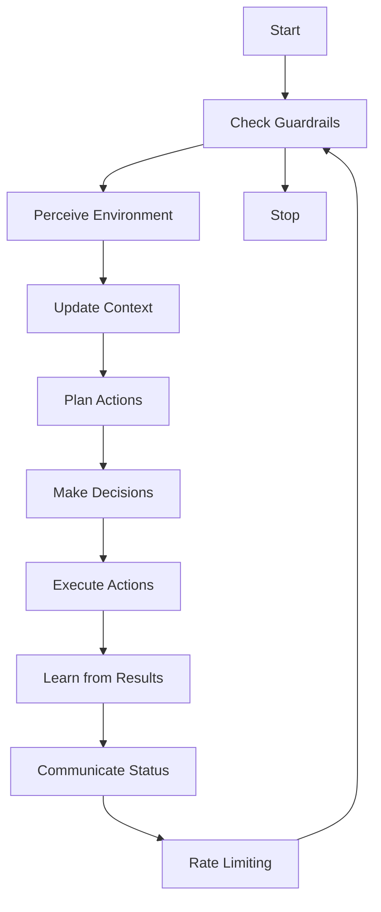
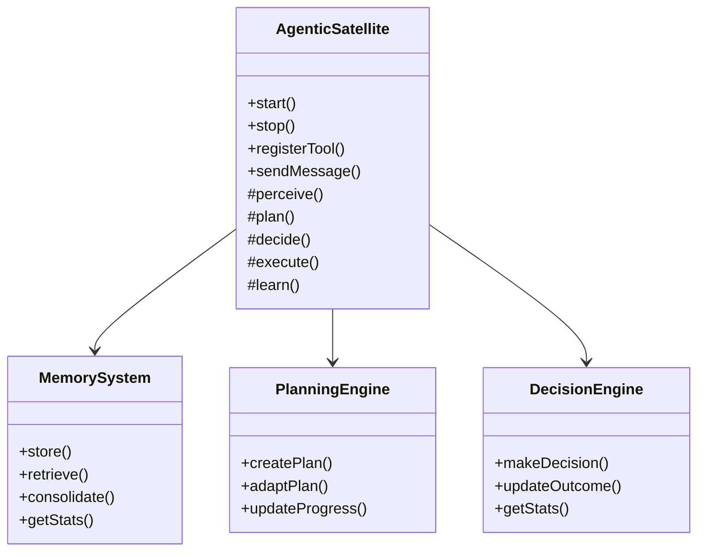

# Architecture de Base - Vegapunk Agentic

## 🏗️ Vue d'ensemble de l'architecture

L'architecture de base suit les principes d'Anthropic : **simplicité, transparence, et progression itérative**.

## 📋 Composants Implémentés ✅

### 1. Interfaces et Types de Base
**Fichier**: `src/interfaces/base.types.ts`
- Types fondamentaux (AgentStatus, GoalType, MemoryType)
- Structures de données (Goal, Memory, AgentContext)
- Interfaces pour outils et résultats
- Garde-fous de sécurité

### 2. Capacités Agents
**Fichier**: `src/interfaces/capabilities.types.ts`
- Définition granulaire des capacités
- Profils de capacités prédéfinis
- Système de requis pour les tâches

### 3. Classe AgenticSatellite
**Fichier**: `src/agents/base/AgenticSatellite.ts`
- Classe abstraite pour tous les agents
- Cycle autonome principal
- Gestion des événements
- Système de garde-fous intégré
- Métriques de performance

### 4. Système de Mémoire
**Fichier**: `src/memory/MemorySystem.ts`
- Mémoire court-terme et long-terme
- Consolidation automatique
- Recherche sémantique basique
- Gestion de capacité

### 5. Moteur de Planification
**Fichier**: `src/agents/base/PlanningEngine.ts`
- Planification hiérarchique
- Support séquentiel et parallèle
- Adaptation de plans
- Évaluation de faisabilité

### 6. Moteur de Décision
**Fichier**: `src/agents/base/DecisionEngine.ts`
- Prise de décision multi-critères
- Évaluation des risques
- Apprentissage historique
- Contraintes de sécurité

## 🔄 Cycle Autonome Principal



## 🛡️ Système de Garde-fous

### Contraintes Temps Réel
- Temps d'exécution maximum
- Utilisation mémoire limitée
- Nombre d'opérations concurrentes
- Timeout par cycle

### Contraintes Fonctionnelles
- Outils autorisés seulement
- Actions bloquées spécifiées
- Contraintes éthiques
- Limites d'autonomie

## 📊 Métriques et Observabilité

### Métriques Agent
- Tâches complétées/tentées
- Taux de succès
- Temps de réponse moyen
- Temps de fonctionnement

### Métriques Système
- Utilisation mémoire
- Cycles par seconde
- Erreurs par période
- Performance inter-agents

## 🔧 Outils et Interfaces

### Interface Outil Standard
```typescript
interface AgentTool<TParams, TResult> {
  name: string;
  description: string;
  parameters: ZodSchema<TParams>;
  execute: (params: TParams) => Promise<ToolResult<TResult>>;
  timeout?: number;
}
```

### Système d'Événements
- Événements de cycle de vie agent
- Communication inter-agents
- Événements de performance
- Gestion d'erreurs centralisée

## 🏃‍♂️ Progression Itérative

### Phase Actuelle (1.2) ✅
- [x] Architecture de base implémentée
- [x] Systèmes fondamentaux opérationnels
- [x] Interfaces propres et documentées
- [x] Garde-fous de sécurité

### Phase Suivante (1.3)
- [ ] Implémentation ShakaAgent
- [ ] Intégration LLM réelle
- [ ] Système de communication
- [ ] Tests d'autonomie

## 📐 Principes de Design

### 1. Simplicité First
- Commencer par le minimum viable
- Ajouter complexité seulement si nécessaire
- Interfaces claires et documentées

### 2. Transparence
- Toutes les décisions sont traçables
- Logging complet des actions
- Métriques observables

### 3. Sécurité Intégrée
- Garde-fous à tous les niveaux
- Validation des entrées
- Gestion d'erreurs robuste

### 4. Extensibilité
- Architecture modulaire
- Interfaces standardisées
- Système de plugins pour outils

## 🔗 Relations Entre Composants



## ⚡ Optimisations Futures

### Performance
- Cache intelligents pour mémoire
- Parallélisation des décisions
- Optimisation des cycles

### Fonctionnalités
- Apprentissage avancé
- Communication complexe
- Orchestration multi-agents

### Sécurité
- Audit complet des actions
- Chiffrement des communications
- Isolation des agents

## 📋 Checklist Implémentation Phase 1.2

- [x] **Types et interfaces** - Définitions complètes
- [x] **AgenticSatellite** - Classe de base fonctionnelle
- [x] **MemorySystem** - Stockage et récupération
- [x] **PlanningEngine** - Planification basique
- [x] **DecisionEngine** - Prise de décision
- [x] **Garde-fous** - Sécurité intégrée
- [x] **Logging** - Observabilité complète
- [x] **Documentation** - Architecture documentée

## 🎯 Prochaines Étapes

1. Tests unitaires pour tous les composants
2. Implémentation ShakaAgent (1ère instance concrète)
3. Intégration avec LLM réels
4. Système de communication inter-agents
5. Tests d'intégration complets