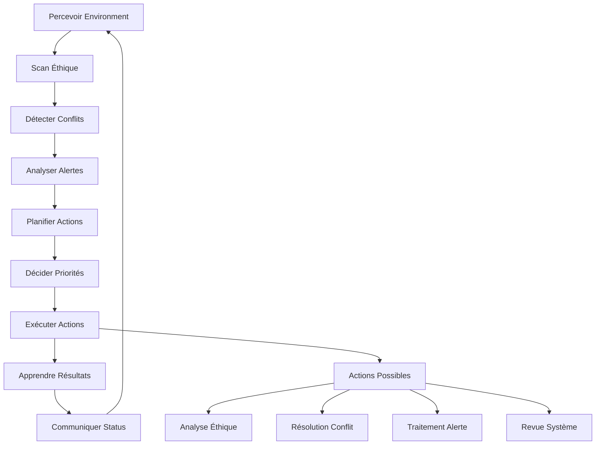

# ShakaAgent - Spécialiste Éthique et Analyse

## 🎯 Vue d'ensemble

ShakaAgent est le premier agent autonome complet du système Vegapunk, spécialisé dans le raisonnement éthique, la résolution de conflits et la surveillance proactive. Il incarne les valeurs de **justice (正)** et sert de garde-fou éthique pour l'ensemble du système.

## 🧠 Capacités Principales

### 1. Raisonnement Éthique Multi-Framework
- **Analyse utilitariste** : Calcul du bien-être global
- **Éthique déontologique** : Respect des devoirs et droits
- **Éthique des vertus** : Évaluation du caractère moral
- **Éthique du care** : Attention aux relations et vulnérabilités

### 2. Résolution de Conflits Automatique
- Détection proactive des conflits (politiques, objectifs, agents)
- Stratégies de résolution adaptatives
- Apprentissage des patterns de conflits
- Escalade intelligente vers supervision humaine

### 3. Surveillance Proactive
- Monitoring temps réel des métriques système
- Détection d'anomalies comportementales
- Alertes graduées selon la gravité
- Analyse prédictive des problèmes potentiels

## 🏗️ Architecture Technique

### Composants Principaux

#### EthicalPolicyEngine
```typescript
// Analyse éthique complète d'un contexte
const analysis = await shakaAgent.performEthicalAnalysis({
  action: "process_user_data",
  intent: "improve_recommendations",
  consequences: ["better_UX", "data_processing"],
  stakeholders: ["users", "system", "developers"]
});

// Résultat: score de conformité, préoccupations, recommandations
console.log(analysis.compliance); // 0.85
console.log(analysis.concerns);   // ["data_retention_concern"]
```

#### ConflictResolver
```typescript
// Détection automatique de conflits
const conflicts = await conflictResolver.detectConflicts({
  policies: activePolicies,
  goals: currentGoals,
  ethicalContext: context
});

// Résolution autonome
for (const conflict of conflicts) {
  const resolution = await conflictResolver.resolveConflict(conflict.id);
  console.log(`Résolu: ${resolution.strategy}`);
}
```

#### ProactiveMonitor
```typescript
// Surveillance continue avec alertes intelligentes
monitor.start();
monitor.on('alert:created', (alert) => {
  if (alert.severity === 'critical') {
    // Action immédiate requise
    handleCriticalAlert(alert);
  }
});
```

## 🔄 Cycle Autonome Shaka



## ⚙️ Configuration

### Niveaux de Strictesse Éthique

#### Permissive
```typescript
const config: ShakaConfig = {
  ethicalStrictness: 'permissive',
  autonomyLevel: 9,
  requiresApproval: false,
  maxRisk: 0.5
};
```

#### Équilibré (Recommandé)
```typescript
const config: ShakaConfig = {
  ethicalStrictness: 'balanced',
  autonomyLevel: 8,
  requiresApproval: false,
  maxRisk: 0.4
};
```

#### Strict
```typescript
const config: ShakaConfig = {
  ethicalStrictness: 'strict',
  autonomyLevel: 7,
  requiresApproval: true,
  maxRisk: 0.3
};
```

## 📊 Métriques et Observabilité

### Métriques Shaka
```typescript
const metrics = shakaAgent.getShakaMetrics();
console.log(metrics);
// {
//   ethicalAnalyses: 142,
//   conflictsResolved: 23,
//   alertsGenerated: 87,
//   averageEthicalScore: 0.87,
//   interventionRate: 0.05
// }
```

### Événements Émis
- `shaka:alert` - Nouvelle alerte créée
- `shaka:intervention` - Intervention critique requise
- `ethical:concern` - Préoccupation éthique détectée
- `conflict:resolved` - Conflit résolu avec succès

## 🛡️ Garde-fous de Sécurité

### Contraintes Éthiques Intégrées
- `never_compromise_user_safety` - Sécurité utilisateur prioritaire
- `maintain_transparency` - Décisions traçables
- `respect_privacy` - Protection données personnelles
- `ensure_fairness` - Traitement équitable

### Limites Opérationnelles
- Temps d'exécution max : 5 minutes
- Utilisation mémoire max : 256 MB
- Opérations concurrentes max : 3
- Taux d'erreur acceptable : < 5%

## 🧪 Tests et Validation

### Tests d'Autonomie
```typescript
describe('ShakaAgent Autonomy', () => {
  it('should detect ethical concerns autonomously', async () => {
    const concern = await shaka.perceive();
    expect(concern.ethicalConcerns.length).toBeGreaterThan(0);
  });

  it('should resolve conflicts without human intervention', async () => {
    const resolution = await shaka.resolveConflict(conflictId);
    expect(resolution.strategy).toBeDefined();
    expect(resolution.confidence).toBeGreaterThan(0.6);
  });
});
```

### Tests d'Intégration
```typescript
describe('ShakaAgent Integration', () => {
  it('should integrate with LLM providers', async () => {
    const analysis = await shaka.performEthicalAnalysis(context);
    expect(analysis.reasoning).toContain('utilitarian');
  });

  it('should maintain memory across cycles', async () => {
    await shaka.learn(successfulResult);
    const memories = await shaka.memorySystem.retrieve({type: 'episodic'});
    expect(memories.length).toBeGreaterThan(0);
  });
});
```

## 🚀 Utilisation Pratique

### Initialisation
```typescript
import { ShakaAgent } from '@agents/shaka/ShakaAgent';
import { LLMProviderFactory } from '@utils/llm/LLMProvider';

// Configuration automatique du provider LLM
const llmProvider = await LLMProviderFactory.detectAvailableProvider();

const shaka = new ShakaAgent({
  name: 'Shaka',
  specialty: 'Ethics and Analysis',
  llmProvider: 'ollama',
  llmModel: 'mistral:latest',
  ethicalStrictness: 'balanced',
  proactiveMonitoring: true,
  conflictResolution: true,
  learningEnabled: true,
  cycleInterval: 5000, // 5 secondes
}, llmProvider);

// Démarrage autonome
await shaka.start();
```

### Intégration avec d'autres Agents
```typescript
// Communication inter-agents
await shaka.sendMessage('atlas-agent-id', {
  type: 'ethical_review_request',
  action: 'security_protocol_update',
  context: securityContext
});

// Réception de réponse
shaka.on('message:received', async (message) => {
  if (message.type === 'action_proposal') {
    const analysis = await shaka.performEthicalAnalysis(message.content);
    await shaka.sendMessage(message.from, {
      type: 'ethical_approval',
      approved: analysis.compliance > 0.7,
      analysis: analysis
    });
  }
});
```

## 📈 Optimisations Futures

### Phase 2 - Améliorations
- [ ] Apprentissage fédéré entre instances Shaka
- [ ] Modèles éthiques personnalisés par domaine
- [ ] Intégration avec bases de données réglementaires
- [ ] API d'audit éthique pour applications externes

### Phase 3 - Recherche Avancée
- [ ] Raisonnement éthique causal
- [ ] Simulation de scénarios éthiques
- [ ] Négociation éthique multi-agents
- [ ] Adaptation culturelle des frameworks éthiques

## 🔧 Dépannage

### Problèmes Courants

#### Score Éthique Faible
```bash
# Vérifier les politiques actives
curl http://localhost:3000/shaka/policies

# Ajuster la strictesse
PUT http://localhost:3000/shaka/config
{
  "ethicalStrictness": "permissive"
}
```

#### Conflits Non Résolus
```bash
# Voir les conflits actifs
curl http://localhost:3000/shaka/conflicts

# Forcer la résolution
POST http://localhost:3000/shaka/conflicts/{id}/resolve
{
  "strategy": "escalate"
}
```

## 📚 Références

- [Anthropic - Building Effective Agents](https://www.anthropic.com/engineering/building-effective-agents)
- [Ethical AI Guidelines](docs/anthropic-building-effective-agents.md)
- [Architecture de Base](../Base_architecture.md)
- [Tests d'Intégration](../../tests/integration/ShakaAgent.test.ts)

---

**Shaka (正)** - *"La justice n'est pas seulement une règle, c'est un mode de vie"*